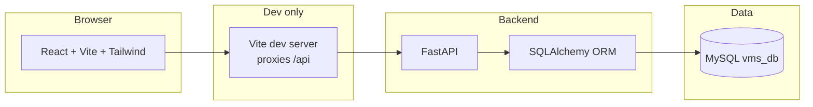

# Vehicle Service Management System (VMS)

A full-stack application for managing vehicle service operations: customers, vehicles, service centers, mechanics, service requests, inspections, work orders (with labor and parts lines), spare-part inventory, and billing. The system is built as a **React SPA** talking to a **FastAPI** backend over **REST**. **MySQL** scripts target local development; **PostgreSQL** scripts under `database/postgres/` target **Neon** (or any Postgres host).

---

## Table of contents

1. [What this project does](#what-this-project-does)
2. [High-level architecture](#high-level-architecture)
3. [Technology stack](#technology-stack)
4. [Repository layout](#repository-layout)
5. [How the database is designed](#how-the-database-is-designed)
6. [How the backend works](#how-the-backend-works)
7. [How the frontend works](#how-the-frontend-works)
8. [How requests flow through the system](#how-requests-flow-through-the-system)
9. [Dashboard and reports](#dashboard-and-reports)
10. [Naming: SQL, API, and UI](#naming-sql-api-and-ui)
11. [Local setup (run everything)](#local-setup-run-everything)
12. [Environment variables](#environment-variables)
13. [Neon + Vercel (hosted database + SPA)](#neon--vercel-hosted-database--spa)
14. [Useful URLs](#useful-urls)
15. [Further documentation](#further-documentation)
16. [Demo data localization (Pakistan)](#demo-data-localization-pakistan)

---

## What this project does

- **Customers & vehicles**: Owners and their vehicles; vehicles support **subtypes** (car, motorcycle, truck) in separate tables linked to the main `vehicles` row.
- **Service workflow**: A vehicle gets a **service request** at a **service center** → optional **inspection** by a **mechanic** → **work order** → **bill**.
- **Operations**: **Mechanics** belong to centers. **Inventory** is per center (`service_center_inventory`). **Work orders** can assign multiple mechanics (`work_order_mechanics`) and consume parts (`work_order_parts`).
- **UI**: Sidebar navigation drives React Router pages for each area; forms call REST endpoints via a small `apiClient`.

---

## High-level architecture



In **production**, you typically serve the built static assets from a CDN or web server and point `VITE_API_BASE_URL` at the real API host (no Vite proxy).

---

## Technology stack

| Layer | Technology |
|-------|------------|
| **Frontend** | React 19, React Router 6, Vite 7, Tailwind CSS 4 (`@tailwindcss/vite`) |
| **Backend** | Python 3, FastAPI, Uvicorn, Pydantic / pydantic-settings |
| **ORM** | SQLAlchemy 2.x |
| **DB drivers** | PyMySQL (`mysql+pymysql://…`) locally; **psycopg** (`postgresql+psycopg://…`) for Neon/Postgres |
| **Database** | MySQL 8.x / 9.x locally; **PostgreSQL** (e.g. Neon) for hosted |
| **Schema** | Hand-written SQL: `database/schema/` (MySQL), `database/postgres/` (Postgres / Neon) |

---

## Repository layout

```
VMS/
├── backend/                 # FastAPI application
│   ├── app/
│   │   ├── main.py          # App entry: CORS, /health, mounts /api/v1
│   │   ├── api/v1/api.py    # Aggregates feature routers
│   │   ├── core/config.py   # Settings (DATABASE_URL, APP_NAME)
│   │   ├── db/              # Engine + SessionLocal + declarative Base
│   │   └── modules/         # One package per domain (customers, vehicles, …)
│   ├── requirements.txt
│   └── .env.example
├── frontend/
│   ├── src/
│   │   ├── routes/AppRouter.jsx
│   │   ├── components/layout/   # AppLayout, Sidebar, …
│   │   ├── lib/apiClient.js     # fetch wrapper + ApiError
│   │   └── features/<domain>/   # pages, components, services, validators
│   ├── vite.config.js       # dev proxy: /api → FastAPI :8000
│   └── .env.example
├── database/
│   ├── schema/              # 001 … 007 SQL — MySQL (run in order)
│   ├── postgres/            # Postgres / Neon DDL + seeds + README
│   ├── seed/                # 001 … 005 sample data (run after schema)
│   ├── docs/                # data_dictionary, EERD mapping notes
│   └── README.md            # Schema/seed run order
└── README.md                # This file
```

---

## How the database is designed

The logical model follows a classic **service garage** EERD:

- **One-to-many**: e.g. `customers` → `vehicles`; `service_centers` → `mechanics`.
- **One-to-one** (enforced with **UNIQUE** foreign keys): `service_requests` → `inspections` (`request_id`); `inspections` → `work_orders` (`inspection_id`); `work_orders` → `bills` (`work_order_id`).
- **Specialization**: `vehicles` + subtype tables `cars`, `motorcycles`, `trucks` (PK = `vehicle_id`, CASCADE delete).
- **Many-to-many** (junction tables): `work_order_mechanics`, `work_order_parts`; inventory `service_center_inventory` (composite PK `(center_id, part_id)`).

**Apply scripts in order:**

1. `database/schema/001_create_database.sql` … `007_views.sql`  
2. `database/seed/001_*.sql` … `005_*.sql`  

Details: `database/README.md` and `database/docs/data_dictionary.md`.  
View definitions (e.g. `vw_low_stock_parts`, `vw_pending_bills`, `vw_service_request_summary`) mirror reporting rules; the backend often uses equivalent ORM queries rather than selecting from views directly.

---

## How the backend works

### Configuration

- **`app/core/config.py`**: Loads **`DATABASE_URL`** and **`APP_NAME`** from environment variables and from **`backend/.env`** (resolved next to the backend folder, so startup does not depend on the shell’s current working directory).

### Database session

- **`app/db/session.py`**: Creates a global SQLAlchemy **`engine`** from `DATABASE_URL` and **`SessionLocal`**. FastAPI dependencies call **`get_db()`** to yield a session per request.

### Feature modules (`app/modules/<name>/`)

Each domain typically includes:

| File | Role |
|------|------|
| `model.py` | SQLAlchemy models mapping to MySQL tables |
| `schema.py` | Pydantic models for request/response bodies |
| `service.py` | Queries and business rules |
| `router.py` | FastAPI `APIRouter` with HTTP methods |
| `__init__.py` | Re-exports `router` for `api.py` |

**Special case — spare parts:** HTTP routes live in **`routes.py`** (not `router.py`) so the package can expose `router` without clashing with Python’s submodule import rules.

### API mounting

- **`app/main.py`**: Mounts **`api_v1.router`** at **`/api/v1`**.
- **`app/api/v1/api.py`**: Registers routers with **kebab-case URL prefixes** (e.g. `/service-requests`, `/work-orders`) matching REST conventions.

### Implemented route groups (version 1)

| Prefix | Purpose |
|--------|---------|
| `/customers` | Customer CRUD |
| `/vehicles` | Vehicle CRUD + subtype payloads |
| `/service-centers` | Centers CRUD |
| `/mechanics` | Mechanics CRUD |
| `/service-requests` | Service request CRUD |
| `/inspections` | Inspection CRUD |
| `/work-orders` | Work orders + nested **mechanics** and **parts** lines |
| `/spare-parts` | Parts catalog CRUD |
| `/inventory` | Per-center stock + low-stock listing |
| `/bills` | Bills CRUD (one bill per work order) |
| `/reports` | Read-only dashboard summary + pending bills + service-request pipeline |

Global endpoints:

- **`GET /health`** — liveness (no DB).
- **`GET /api/v1/ping`** — confirms v1 router mount (no DB).

---

## How the frontend works

### Entry and routing

- **`src/main.jsx`** mounts the React app with **`BrowserRouter`**.
- **`src/routes/AppRouter.jsx`** nests routes under **`AppLayout`** (sidebar + top bar + `<Outlet />`).
- **`src/config/navigation.js`** defines sidebar links; paths must stay aligned with **`AppRouter.jsx`**.

### API access

- **`src/lib/apiClient.js`**: Builds URLs from **`VITE_API_BASE_URL`** + path (e.g. `/api/v1/customers`). Handles JSON, errors, and **`ApiError`**.
- **Development:** **`vite.config.js`** proxies **`/api`** to **`http://127.0.0.1:8000`**. Recommended **`VITE_API_BASE_URL=http://127.0.0.1:5173`** so the browser calls the same origin and avoids CORS pitfalls when the API returns errors.
- **Production build:** Point **`VITE_API_BASE_URL`** at the real API origin and ensure CORS on the backend allows your deployment origin.

### Feature folders

Under **`src/features/<name>/`**:

- **`pages/`** — route-level screens  
- **`components/`** — tables, forms, panels  
- **`services/*.js`** — thin wrappers around **`apiClient`** (`GET`, `POST`, `PATCH`, `DELETE`)  
- **`validators/`** — client-side form validation aligned with backend rules  

### Main screens

| Route | Role |
|-------|------|
| `/` | Dashboard: summary counts, recent pipeline table, low stock + pending bills panels |
| `/customers`, `/vehicles`, … | CRUD pages per domain |
| `/reports` | Summary cards + filterable pipeline table |

---

## How requests flow through the system

Example: **record a service visit end-to-end**

1. **Customer & vehicle** exist (`POST /api/v1/customers`, `POST /api/v1/vehicles` with optional subtype).
2. User creates **`service_requests`** (`POST /api/v1/service-requests`) with `vehicle_id`, `center_id`, dates, status.
3. Optional **`inspections`** row (`POST /api/v1/inspections`) with `request_id` unique.
4. **`work_orders`** (`POST /api/v1/work-orders`) tied to `inspection_id`.
5. Assign labor: **`POST /api/v1/work-orders/{id}/mechanics`**. Add parts: **`POST /api/v1/work-orders/{id}/parts`** (catalog prices vs `sale_price_at_use` are separate concerns).
6. **`POST /api/v1/bills`** with `work_order_id` (unique). Inventory is **not** automatically decremented when parts are added; stock is maintained via **`/inventory`** endpoints.

---

## Dashboard and reports

- **`GET /api/v1/reports/dashboard-summary`**: Aggregate counts (total customers, vehicles, open service requests, ongoing work orders, pending bills, low-stock SKU count). Uses full-table counts, not paginated list caps.
- **`GET /api/v1/reports/pending-bills`**: Rows for unpaid/pending bills (aligned with `vw_pending_bills` semantics).
- **`GET /api/v1/reports/service-request-pipeline`**: Joined pipeline (vehicle, customer, center, optional inspection/work order), aligned with `vw_service_request_summary` semantics.
- **`GET /api/v1/inventory/low-stock`**: Low-stock rows for the spare-parts UI.

---

## Naming: SQL, API, and UI

| Concept | MySQL / SQLAlchemy | REST path (v1) | Frontend folder |
|---------|-------------------|----------------|-----------------|
| Service center | `service_centers` | `/service-centers` | `serviceCenters` |
| Service request | `service_requests` | `/service-requests` | `serviceRequests` |
| Work order | `work_orders` | `/work-orders` | `workOrders` |
| Spare part | `spare_parts` | `/spare-parts` | `spareParts` |

JSON field names use **snake_case** (FastAPI/Pydantic default), matching the database columns.

---

## Local setup (run everything)

**Prerequisites:** Python 3.11+, Node 18+, MySQL server running, `mysql` client optional but helpful.

### 1. Database

Create and load schema + seeds (from repo root, adjust user/host):

```bash
mysql -u root -p < VMS/database/schema/001_create_database.sql
mysql -u root -p vms_db < VMS/database/schema/002_create_master_tables.sql
# … repeat 003 through 007 …
mysql -u root -p vms_db < VMS/database/seed/001_seed_master_data.sql
# … repeat seeds through 005 …
```

See **`database/README.md`** for the full ordered list.

### 2. Backend

```bash
cd VMS/backend
python3 -m venv .venv
source .venv/bin/activate   # Windows: .venv\Scripts\activate
pip install -r requirements.txt
cp .env.example .env        # then edit DATABASE_URL
uvicorn app.main:app --host 127.0.0.1 --port 8000
```

### 3. Frontend

```bash
cd VMS/frontend
cp .env.example .env        # use dev proxy URL if using vite.config proxy
npm install
npm run dev -- --host 127.0.0.1 --port 5173
```

### 4. Smoke tests

```bash
curl http://127.0.0.1:8000/health
curl http://127.0.0.1:8000/api/v1/ping
curl "http://127.0.0.1:8000/api/v1/customers?skip=0&limit=5"
```

Production bundle:

```bash
cd VMS/frontend && npm run build
```

---

## Environment variables

### Backend (`VMS/backend/.env`)

| Variable | Meaning |
|----------|---------|
| `DATABASE_URL` | SQLAlchemy URL. **MySQL:** `mysql+pymysql://…` (see `database/schema/`). **Neon (Postgres):** `postgresql+psycopg://…?sslmode=require` (see `database/postgres/`). |
| `APP_NAME` | Shown in OpenAPI title |
| `CORS_ALLOW_ORIGINS` | Optional comma-separated extra origins (e.g. `https://your-app.vercel.app`) merged with local Vite defaults |
| `CORS_ALLOW_ORIGIN_REGEX` | Optional single regex (e.g. `https://.*\.vercel\.app`) so every Vercel preview URL is allowed without listing each PR |

### Frontend (`VMS/frontend/.env`)

| Variable | Meaning |
|----------|---------|
| `VITE_API_BASE_URL` | Origin for API calls (no trailing slash). Dev + proxy: `http://127.0.0.1:5173`. Direct API: `http://127.0.0.1:8000`. Production: your deployed FastAPI origin (`https://…`). |
| `VITE_APP_NAME` | Optional label for UI |

---

## Neon + Vercel (hosted database + SPA)

1. **Neon:** Create a Postgres database and run the scripts in **`database/postgres/`** in order (DDL `002`–`007`, then `seed_*`, then **`008_align_sequences.sql`**). Copy the pooled connection string with **`sslmode=require`**.
2. **Backend:** Set **`DATABASE_URL=postgresql+psycopg://…`** in the environment where you run FastAPI (Railway, Render, Fly.io, a VPS, etc.). Vercel is optimized for static sites and serverless functions; this repo’s API is a normal ASGI app — host it where long-lived Python processes are supported.
3. **CORS:** Set **`CORS_ALLOW_ORIGIN_REGEX`** to `https://.*\.vercel\.app` on the API so **every PR preview** and production deployment on `*.vercel.app` can call the backend. Alternatively (or additionally), list fixed origins in **`CORS_ALLOW_ORIGINS`**.
4. **Frontend on Vercel:** In [Vercel](https://vercel.com) → **Add New…** → **Project** → import your GitHub repo **`Vehicle-Managment-System`** (or fork).
   - **Root Directory:** Either leave it **empty** or set **`VMS/frontend`** (pick **one** and stick to it).
     - **Empty:** Repo-root **`vercel.json`** runs **`cd VMS/frontend && npm ci`** then **`npm run build`**, output **`VMS/frontend/dist`**, SPA **`rewrites`** included.
     - **`VMS/frontend`:** Uses **`VMS/frontend/vercel.json`** with explicit **`npm ci`**, **`npm run build`**, **`dist`**, and SPA **`rewrites`** (does not rely on framework auto-detection alone).
   - **Node:** **`engines.node`** and **`.nvmrc`** request **Node 20+** (needed for a reliable Vite 7 / Tailwind v4 build on Vercel).
   - **Framework Preset:** **Other** or leave default when Root Directory is **empty** (root **`vercel.json`** already defines install/build/output). When Root Directory is **`VMS/frontend`**, choose **Vite**.
   - **Important:** Under Project → Settings → **Build & Development**, if **Build Command**, **Output Directory**, or **Install Command** were overridden manually, click **Reset** or align them with this repo — dashboard overrides beat **`vercel.json`** and often cause **404** (wrong folder deployed).
   - **Environment variables** (Project → Settings → Environment Variables):
     - **`VITE_API_BASE_URL`** = your public FastAPI origin, e.g. `https://your-api.onrender.com` (no trailing slash, no `/api` suffix). Apply to **Production**, **Preview**, and **Development** as needed so PR previews call the same API.
     - Optional: **`VITE_APP_NAME`**.
   - Save and deploy. **Pull Request previews** are created automatically once the GitHub integration is enabled (each PR gets its own `*.vercel.app` URL).
5. **Smoke-test:** Open the deployed URL, check browser DevTools → Network: API calls should go to **`VITE_API_BASE_URL`**. If you see CORS errors, confirm **`CORS_ALLOW_ORIGIN_REGEX`** or **`CORS_ALLOW_ORIGINS`** on the backend includes that frontend origin.

**404 on Vercel:** (a) **Dashboard overrides** — reset Build / Output / Install commands so **`vercel.json`** applies. (b) **Root Directory** — empty uses repo-root **`vercel.json`** + **`VMS/frontend/dist`**; **`VMS/frontend`** uses the inner **`vercel.json`** + **`dist`**. (c) **SPA deep links** — **`rewrites`** send non-file paths to **`/index.html`**. The repo root **`package.json`** defines **`npm run build`** → **`VMS/frontend`** so a default Vercel build also targets the right app. Redeploy after fixes.

**White screen (blank page):** View page source (Ctrl+U). If you see **`<script type="module" src="/src/main.jsx">`**, Vercel is serving the **dev** `index.html`, not **`vite build`** output — the JS never loads. Fix: **Production Build** must run (**`npm run build`**), **Output Directory** must be **`dist`** (not `.` or repo root), **Root Directory** **`VMS/frontend`** (or empty + root **`vercel.json`**). In deployment **Build Logs**, confirm **`vite build`** completes and listing shows **`dist/index.html`** with **`/assets/*.js`** hashes.

**CLI deploy (optional):** From the repo root, after `npx vercel login`: `npx vercel --prod` (uses root **`vercel.json`**). From **`VMS/frontend`** only if the Vercel project’s Root Directory is set to that folder: `cd VMS/frontend && npx vercel --prod`.

---

## Useful URLs

| Service | URL |
|---------|-----|
| Frontend (dev) | http://127.0.0.1:5173 |
| Backend API | http://127.0.0.1:8000 |
| OpenAPI docs | http://127.0.0.1:8000/docs |
| Health | http://127.0.0.1:8000/health |

---

## Further documentation

- **`database/README.md`** — SQL run order  
- **`database/docs/data_dictionary.md`** — Table/column overview  
- **`database/docs/eerd_to_schema_mapping.md`** — How EERD concepts map to SQL  

---

## Demo data localization (Pakistan)

- **Seed scripts** under `database/seed/` use **Pakistani-style demo content**: names (e.g. Muhammad Ali Khan, Zainab Khan), **+92** phone numbers, **`.pk` / `@example.pk`** sample emails, cities (Lahore, Karachi, Faisalabad, Sialkot, …), and area-style addresses (Johar Town, North Nazimabad, Peoples Colony). Service centers in seeds read like local workshops (e.g. **Lahore Motor Clinic**, **Karachi Auto Point**, **Rizwan Diesel Works**). Sample registration numbers follow a three-part style such as **`LEA-23-1456`**, **`ICT-21-3344`**, **`KHI-20-9087`** (demo only).
- **Vehicles**: Common Pakistan-market examples include **Toyota Corolla / Hilux / Yaris**, **Honda Civic / City / CD 70**, **Suzuki Cultus / Alto**, **Yamaha YBR 125**.
- **Money**: Catalog **unit prices**, **labor rates**, **work-order line prices**, and **bill totals** in seeds are **PKR** (numeric `DECIMAL` columns unchanged).
- **Payments**: The schema stores **payment status** on bills; operators often settle with **Cash**, **Bank Transfer**, **JazzCash**, or **Easypaisa** — the UI mentions these as guidance only (no extra JSON fields).
- **UI**: Amounts use **`Intl.NumberFormat`** **PKR** (`frontend/src/lib/formatters.js`). Calendar dates are shown as **DD-MM-YYYY** for readability; APIs still use ISO **YYYY-MM-DD** where applicable.

Re-apply seeds after pulling changes (see `database/README.md`); use `DROP DATABASE` / recreate or truncate tables if IDs must stay aligned with the shipped seed files.

---

## Known limitations (by design / backlog)

- **Authentication** is not implemented; `ProtectedRoute.jsx` is a placeholder.
- **Bill `total_amount`** is manual entry; it is not auto-calculated from labor/parts lines.
- **Consuming parts on a work order does not automatically decrement** `service_center_inventory`; operators update inventory through the inventory API/UI.
- **React Router** may log v7 “future flag” warnings in the console; they do not block the app.

---

## License / use

This scaffold is suitable for **learning and demos**. Harden security, backups, and validation before any production deployment.
